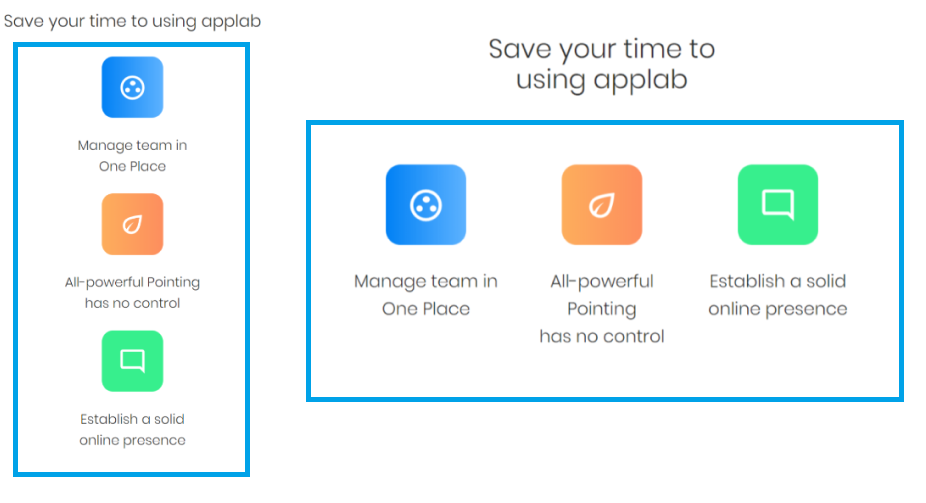
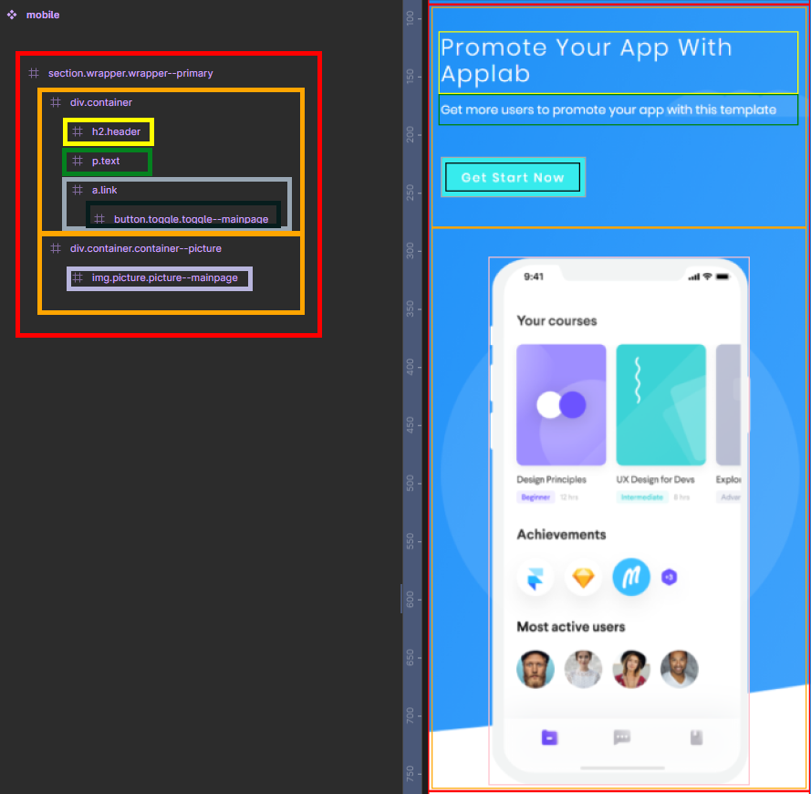
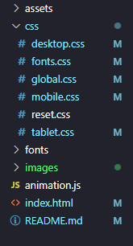
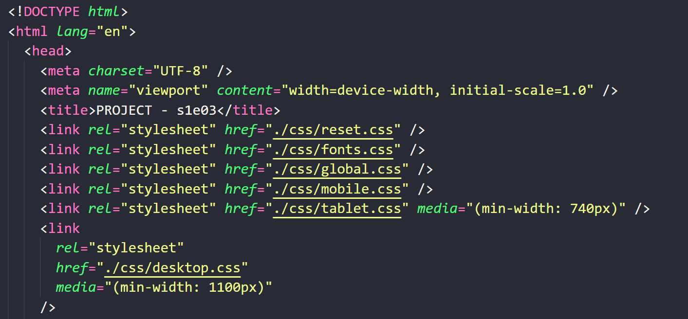

# [Applab RWD landing page](https://typee8.github.io/Applab-RWD-landing-page/)
My first **fully responsive** website! It's the conclusion of **3rd chapter** (there's **20**) of [devmentor.pl](https://devmentor.pl/mentoring-javascript) mentoring program which focuses on HTML, CSS and RWD. It's been written in **HTML** and **CSS** with a little help of **Javascript** (for navbar improvement). Website's design is based on [Colorlib template](https://colorlib.com/wp/template/applab/).

---

## Content:
#### 1) [Challenges:](#plan-html-and-bem-class-structure-in-figma)
 [1. Plan HTML and BEM class structure (in Figma).](#plan-html-and-bem-class-structure-in-figma) 
 [2. Universal BEM naming.](#universal-bem-naming) 
 [3. Separation of Concerns (preparing project's directory).](#separation-of-concerns) 
 [4. Navbar dropdown CSS bug. (why I needed to use JS)](#navbar-dropdown-css-bug)

#### 2) [Gained knowledge](#gained-knowledge)

#### 3) [What should I improve?](#what-should-i-improve)

---

### Plan HTML and BEM class structure (in Figma)
Looking at my previous projects, planning HTML elements **nesting** with the right BEM class **naming** is crucial. Miss this part then suffer overriding everything afterwards.
I've **decided to use Figma** for planning because I've been using the software before to design a website and it helps create **project structure and nesting**:

#### Advantages:

- See the project in the bigger picture.
- A clean HTML structure and thoughtfully chosen class names make the project easy to edit, ultimately saving time.

#### What I did:

Firstly, I sought out **similar elements** within the project while **observing how they behave** across different layouts. I began with **wrappers:**

.png)

Here we have two pages that **behaves the same way** - they change display at `min-width: 740px` to fill all width space. These wrappers will have the same class in this example `wrapper--primary`.

Next I went to **containers:**

.png)

These containers center their elements at `min-width: 740px`. They'll have the same class `container--center`

Then it's time for **`<h2>` elements:**

They behave the same on different viewports, the only distinction lies in their color. I created two classes for them: `header` for default white color and `header--alpha` for black.

I was doing **the same thing** with other elements. The goal was to minimize the number of classes to **reduce code redundancy** as much as possible.

As I selected **similar elements**, I created the HTML structure and started to think on **appropriate class names** following the BEM methodology. Results looked like this (emmet syntax is neat):

---

### Universal BEM naming

#### Advantages:

- The name shows use case of class.
- Reusable styles.
- Less code to write.

#### a)

Utilizing proper BEM names can be **challenging**. While HTML tags provide content with semantic meaning, they also **group elements**. The initial approach was to use HTML tag names for **naming specific classes**.

It looked like this:
 `<section class="section">` 
or 
 `
` to `<article>` or `
`, or if `<section>` **had the same style as** `<article>`? 

I **replaced** class names **with alternatives** as descriptive as HTML tags:
`<section class="wrapper"`
or
`
`

 This allowed me to **use the same class** for `<section>`, `<article>`, or `
` no matter what semantic meaning was required.

#### b)

Sometimes the only difference between elements is a color:

.png)

Creating a new modifier, such as `header--clr`, to change the style of an element is straightforward. The issue with this naming is that `header--clr` **implies only the color change.** If I need to modify other properties, such as size or line height, I'd have to add additional modifiers like `header--size` or `header--line-height`, resulting in **code clutter.**

I decided to establish a basic style for the `header` and then introduce a modifier, `header--alpha`, to handle color changes and **streamline future style additions.**

#### c)

I had a container which sets `display: flex` on `min-width: 740px`:

I initially created the `container--flex` modifier solely due to the `display: flex` property. However, this name **lacks clarity** regarding the container's purpose. Consequently, I chose to rename it to `container--center` to **clearly convey** the intended effect of centering its elements.

---

### Separation of Concerns

#### Advantage:
- More manageable code.

Before writing HTML and CSS, **I organized folders and files** to ensure the code stays tidy in their designated places.

Taking advantage of the **cascading nature** of CSS and BEM methodology (BEM keeps CSS selectors at lowest specificity possible) it's handy to use different CSS files for each viewport breakpoint:

---

### Navbar dropdown CSS bug

Writing dropdown for sub-containers in CSS creates a bug:

What's wrong with it?: when I click on **Blog** and then click on **Pages**, Blog **lifts up Pages** and the actual **impact of the click is on Contact** which is `<a>` link to the mainpage. The only way around it (that I could find) using CSS is to **use checkboxes** instead of `:hover` but clicking on the other items **doesn't hide** previous sub-containers.

I chose to write JS code for this functionality because it **gets rid of the bug** and **hides previous sub-containers** like in the proper navbar.

#### JS navbar functionality:

- Show/hide navbar.
- Selected elements are highlighted.
- Show/hide sub-containers.
- Hide sub-container after showing another.
- Change navbar's transparent background for black when scrolling (`min-width: 1100px`).

---

## Gained knowledge:
:white_check_mark: Write clean and well-thought-out HTML and CSS (Good planing pays off). 
:white_check_mark: BEM methodology helps in creating reusable styles. 
:white_check_mark: Smart use of `display: flex` & `display: grid`. 
:white_check_mark: Scale site elements to fit on different devices: mobile, tablet, desktop. 
:white_check_mark: Separation of Concerns: create clean folder structure for easy code managing. 
:white_check_mark: Create icons using external editor - [Font Awesome](https://fontawesome.com/). 
:white_check_mark: Use [GitHub Pages](https://pages.github.com/) to set the project on the Web. 
:white_check_mark: Fix bugs as soon as they appear. 
:white_check_mark: Refactor code on regular basis.

---

## What should I improve?:
 :heavy_exclamation_mark: When I'm thinking too much about similarities between elements to assign them the same class, I choose to create distinct classes and move forward.

 :heavy_exclamation_mark: While it's advantageous to plan and name classes thoughtfully, I shouldn't dwell too much on it. Naming things correctly can take time, and it's okay to prioritize progress over perfection when writing code.

 :heavy_exclamation_mark: I should create more informative commits.
